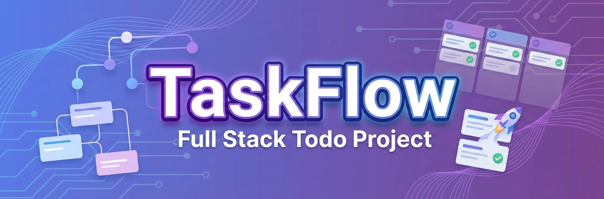
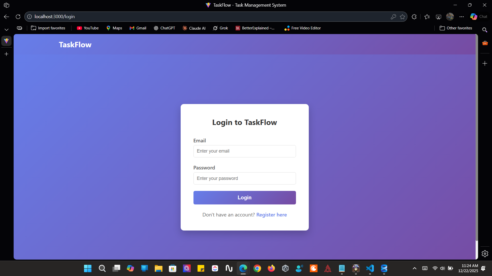
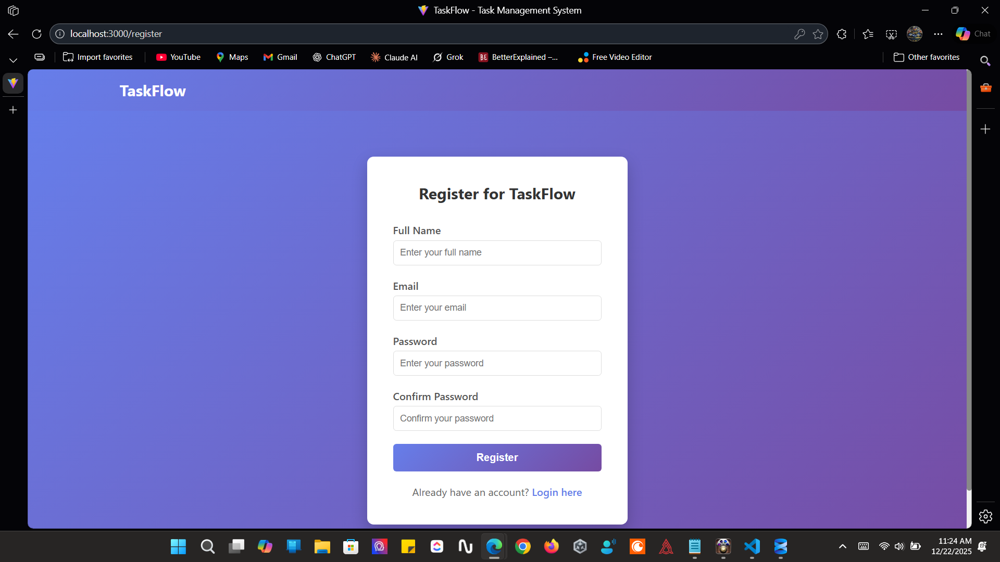
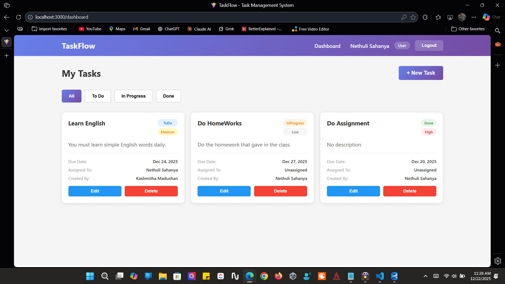
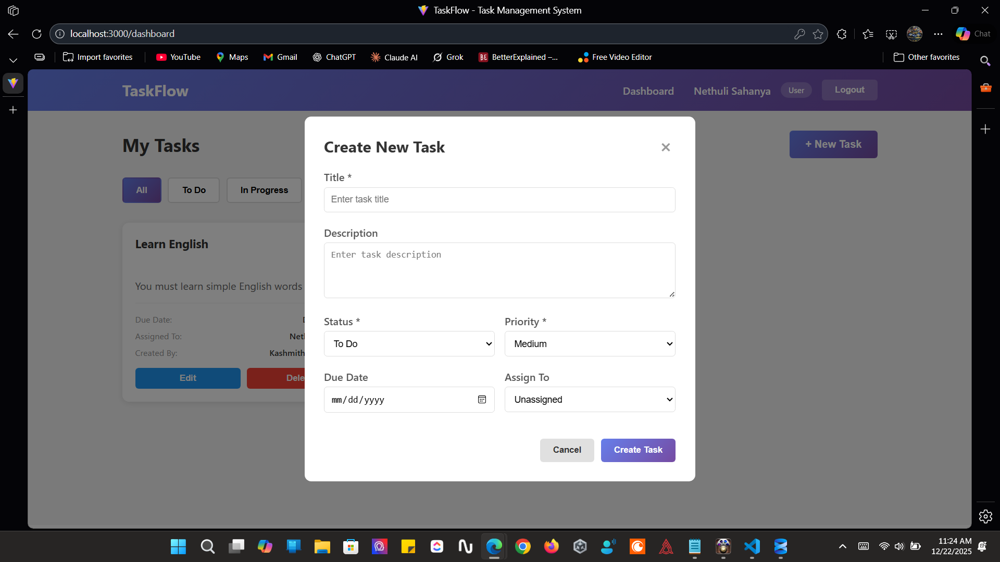

# TaskFlow — Task Management System



TaskFlow is a full-stack task management system that allows users to create, manage, and track tasks efficiently with secure authentication and role-based access control. Built with ASP.NET Core 9 and React 19, and fully containerized with Docker for consistent deployment across any environment.

---

## 🚀 Live Demo

🚧 Coming soon

---

## 📸 Screenshots

### Login Page



### Register Page



### Dashboard



### Create Task



---

## 🎥 Demo Video

▶️ Coming soon

---

## ✨ Features

- User authentication & authorization (JWT)
- Task CRUD operations
- Role-based access control (Admin / User)
- Secure password hashing with BCrypt
- Responsive UI
- RESTful API architecture
- Fully containerized with Docker — runs on any machine with one command

---

## 🛠️ Tech Stack

### Frontend

- React 19
- Vite 7
- Axios
- React Router 7

### Backend

- ASP.NET Core 9
- Entity Framework Core 9
- REST API

### Database

- SQL Server 2022

### Authentication

- JWT (JSON Web Tokens)
- BCrypt password hashing

### DevOps

- Docker
- Docker Compose
- Nginx (reverse proxy + static file serving)
- Multi-stage Docker builds

---

## 🐳 Quick Start with Docker

The easiest way to run TaskFlow. You only need **Docker Desktop** installed — no .NET SDK, Node.js, or SQL Server required.

```bash
# 1. Clone the repository
git clone https://github.com/Kashmitha/dockerized-taskflow-project.git
cd dockerized-taskflow-project

# 2. Create your environment file
cp .env.example .env
# Open .env and set DB_PASSWORD and JWT_KEY

# 3. Build and start everything
docker compose up --build
```

Open **http://localhost:8090** — the app is running.

> See [DOCKER.md](Docker.md) for the full Docker guide, troubleshooting, and how it all works under the hood.

---

## 📦 Manual Installation (without Docker)

### Prerequisites

- [.NET 9 SDK](https://dotnet.microsoft.com/download)
- [Node.js 20+](https://nodejs.org)
- [SQL Server](https://www.microsoft.com/en-us/sql-server/sql-server-downloads)

### 🔹 Backend Setup

```bash
cd Backend
dotnet restore
dotnet ef database update
dotnet run
```

The API will start at `http://localhost:5110`.
Swagger UI is available at `http://localhost:5110/swagger`.

### 🔹 Frontend Setup

```bash
cd Frontend
npm install
npm run dev
```

The app will open at `http://localhost:5173`.

### 🔹 Environment Configuration

Create a `.env` file in the `Frontend/` folder:

```env
VITE_API_URL=http://localhost:5110/api
```

Make sure the connection string in `Backend/appsettings.json` points to your local SQL Server instance.

---

## 🐳 Docker Architecture

When running with Docker, three containers work together on a private network:

```
Browser (http://localhost:8090)
        │
        ▼
┌───────────────────────────────────────────────┐
│             Docker Network                    │
│                                               │
│  ┌──────────────┐     ┌───────────────────┐   │
│  │   Frontend   │───▶│     Backend       │   |
│  │ React + Nginx│/api │  ASP.NET Core 9   │   │
│  │   port 80    │     │    port 5110      │   │
│  └──────────────┘     └────────┬──────────┘   │
│                                │              │
│                       ┌────────▼──────────┐   │
│                       │    SQL Server     │   │
│                       │       2022        │   │
│                       └───────────────────┘   │
└───────────────────────────────────────────────┘
```

- **Multi-stage builds** keep images small — the frontend image ships only Nginx + static files, with no Node.js; the backend image ships only the ASP.NET runtime, with no SDK
- **Nginx reverse proxy** forwards `/api/` calls from the browser to the backend, eliminating CORS issues entirely
- **Named Docker volume** persists database data independently of container lifecycles
- **Health checks** ensure the backend waits for SQL Server to be fully ready before starting
- **Auto-migrations** run on backend startup via EF Core — no manual `dotnet ef` steps needed

---

## 📁 Project Structure

```
TaskFlow/
├── docker-compose.yml        # Container orchestration
├── .env                      # Environment variable template
├── Docker.md                 # Full Docker guide
│
├── Frontend/taskflow-client
│   ├── Dockerfile            # Multi-stage: Node build → Nginx serve
│   ├── nginx.conf            # Reverse proxy config
│   ├── src/
│   │   ├── components/
│   │   ├── pages/
│   │   └── services/
│   └── package.json
│
└── Backend/TaskFlow.API
    ├── Dockerfile            # Multi-stage: SDK build → ASP.NET runtime
    ├── Controllers/
    ├── Models/
    ├── Data/
    ├── Services/
    └── TaskFlow_API.csproj
```

---

## 🔐 API Endpoints

### Authentication

| Method | Endpoint             | Description                 | Auth required |
| ------ | -------------------- | --------------------------- | ------------- |
| POST   | `/api/auth/register` | Register a new user         | No            |
| POST   | `/api/auth/login`    | Login and receive JWT token | No            |

### Tasks

| Method | Endpoint          | Description                    | Auth required |
| ------ | ----------------- | ------------------------------ | ------------- |
| GET    | `/api/tasks`      | Get all tasks for current user | Yes           |
| POST   | `/api/tasks`      | Create a new task              | Yes           |
| PUT    | `/api/tasks/{id}` | Update a task                  | Yes           |
| DELETE | `/api/tasks/{id}` | Delete a task                  | Yes           |

> Full interactive API documentation available at `http://localhost:5110/swagger` when running locally.

---

## 👥 Roles & Permissions

| Feature               | User | Admin |
| --------------------- | ---- | ----- |
| View own tasks        | ✅   | ✅    |
| Create tasks          | ✅   | ✅    |
| Edit own tasks        | ✅   | ✅    |
| Delete own tasks      | ✅   | ✅    |
| View all users' tasks | ❌   | ✅    |
| Manage users          | ❌   | ✅    |

---

## 🤝 Contributing

1. Fork the repository
2. Create a feature branch (`git checkout -b feature/your-feature`)
3. Commit your changes (`git commit -m 'Add some feature'`)
4. Push to the branch (`git push origin feature/your-feature`)
5. Open a Pull Request

---

## 👤 Author

- GitHub: [@Kashmitha](https://github.com/Kashmitha/dockerized-taskflow-project.git)
- LinkedIn: [kashmitha-madushan-362822339](https://www.linkedin.com/in/kashmitha-madushan-362822339/)
